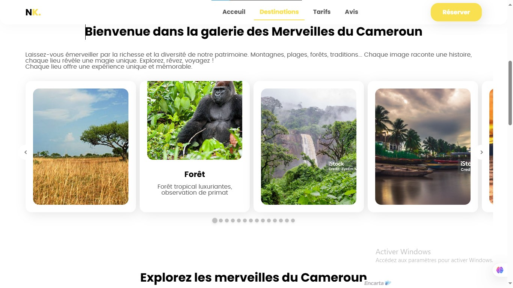
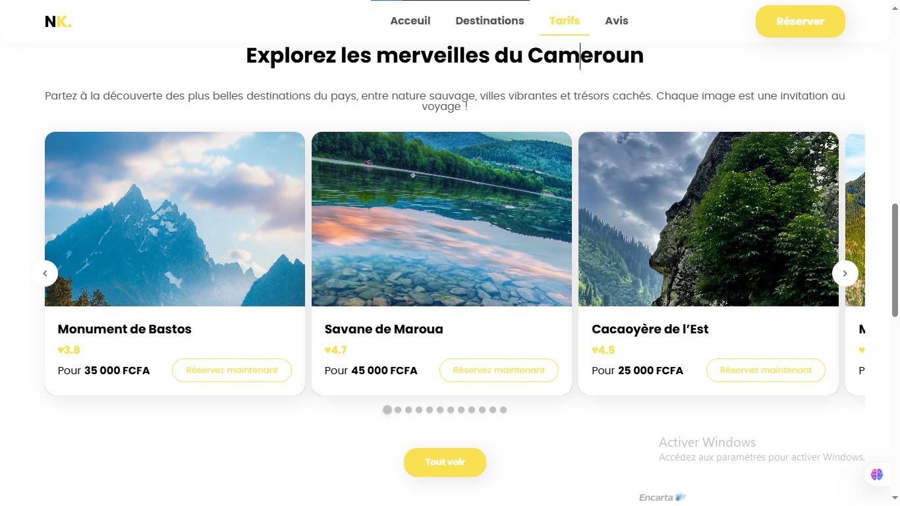
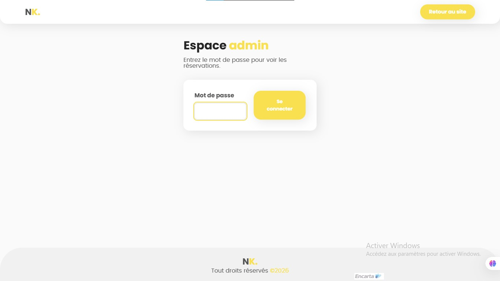
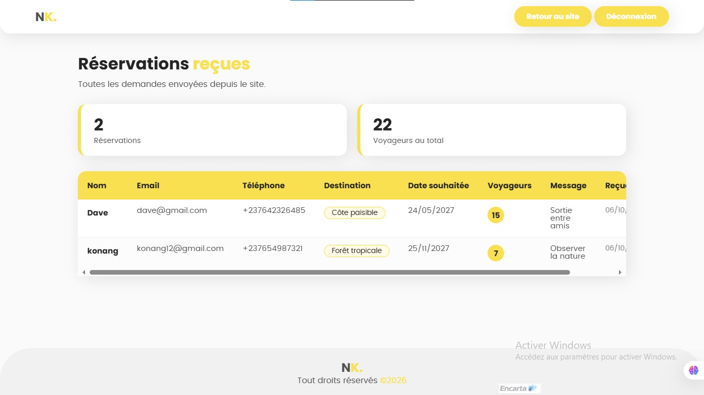

# NovaTourism
Site de tourisme Camerounais avec réservation en ligne. *aller à la découverte des merveilles du **"Continent"***

## Technologies
- HTML, CSS, JavaScript
- PHP, MySQL

## Fonctionnalité
- Formulaire de réservation
- Slide panoramique sur clic
- Validation des données côté serveur (email, téléphone au format international, champs obligatoires)
- Enregistrement en base de données
- Message de confirmation
- Espace admin accesible via `Novatourism/admin.php` protégé par mot de passe.

## Installation
1. Cloner le projet dans le dossier `www` de WAMP
2. Importer `database.sql`dans une base de donner vide nommer `tourisme`
3. Ouvrir `localhost/Navotourism`

## Apercu en images

---

## Amelioration prévues
- Envoi d'un email de confirmation
- Envoie du formulaire sans rechargement de page
- Hebergement en ligne vua **Infinity**
- Obtenir de véritable image caractéristique des lieux mentionnés
- Utilisation d'un `input` pour un abnnement au site

## Auteur
**KONANG Demano Dave Nathan** alliace **NK-DAVE**- je suis élève de terminale C passionné de programmation, d'art et de découverte et ayant une forte volonté de mettre en avant les merveilles de son pays.
---
Ce projet est mon premier site avec un back-end (PHP et MySQL), réliser pour apprendre à relier un formulaire à une base de données. Grâce a celui ci j'ai appris:
- A filtrer les données recu par le formulaire en `PHP`et les stocker puis les récuperer,
- Créer une page admin et la sécuriser grace au `login.php`, puis réaliser la déonnexion grâce au fichier `logout`
- A récupérer les information renvoyer par le `PHP` grâce a l'URL en `JS`
- Que les hébergeur gratuit comme vercel refuse le MySQL >_< et je dois donc m'orienter vers `Infinityfree` mais celui ci bloque par défaut `PHPMailer`pour les *email automatique que je prévois*
- A la mise en page d'un fichier `README.md`
- L'utilisation de `Git` et des principales commande `add, commit, push` et a travailler sur une branche